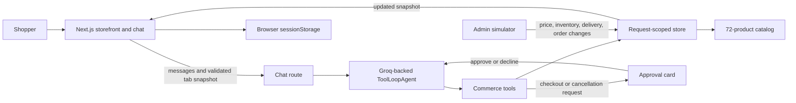

# Cart Pilot

A conversational electronics storefront where an AI shopping agent can search, compare, order, track, and cancel without owning the store's facts.

[Open the live demo](https://cart-pilot-delta.vercel.app/)

The project focuses on a practical AI product problem: how can a model help complete a purchase while the application keeps control of every consequential fact and mutation?

## Product tour

- Browse and search a fictional catalog of 72 electronics across six categories.
- Ask for recommendations using a budget, intended use, preferences, and delivery deadline.
- Compare current specifications, prices, synthetic reviews, inventory, and arrival estimates.
- Approve or decline simulated checkout inside the conversation.
- Track orders and approve eligible cancellations without leaving chat.
- Change inventory, prices, shipping speed, and order status from an admin simulator.
- Return to the conversation and watch the agent respond to the changed store state.

## How it works



Every request rebuilds an isolated store from a Zod-validated snapshot submitted by the current browser tab. Successful order and cancellation tools stream the new snapshot back before returning their result. Refreshing preserves the demo, while a fresh tab starts with separate state.


## Agent capabilities

The shopping agent can call eight typed tools:

| Tool | Purpose |
| --- | --- |
| `searchProducts` | Find products by need, category, price range, or arrival deadline. |
| `getProduct` | Read current details and synthetic reviews. |
| `compareProducts` | Compare two to four products using current catalog facts. |
| `checkInventory` | Verify price, quantity, total, and estimated arrival. |
| `placeOrder` | Create an approved simulated order. |
| `listOrders` | Read the shopper's order history. |
| `getOrder` | Read one order's status and event history. |
| `cancelOrder` | Cancel an approved eligible order and restore inventory. |

The agent has an eight-step ceiling, reserves its last step for a user-facing answer, keeps provider reasoning hidden, and emits structured tool activity to the interface.

## Demo walkthrough

1. Open **Shop** and browse the catalog.
2. Ask: `I need a light laptop under $900 for university, delivered by Friday.`
3. Compare the shortlist and ask about a product's specifications or reviews.
4. Ask Cart Pilot to order your choice.
5. Review the latest price, quantity, delivery estimate, saved address, and simulated card before approving.
6. Open **Admin** in the same tab. Sell out a recommended product, change its price, slow shipping, or delay an order.
7. Return to chat and ask Cart Pilot to check again.
8. Open **Orders** to inspect the order timeline, request an update, or start a cancellation.

This flow demonstrates why the tool boundary matters. The conversation can continue, but the agent must re-read the store before it makes a claim or changes an order.

## Tech stack

| Layer | Technology |
| --- | --- |
| Application | Next.js 16 App Router, React 19, TypeScript 6 |
| Agent | Vercel AI SDK 7 `ToolLoopAgent` and AI SDK React |
| Model provider | Groq, configurable through `GROQ_MODEL` |
| Validation | Zod 4 |
| Chat rendering | React Markdown with GitHub Flavored Markdown |
| Icons | Lucide React |

## Project structure

```text
app/
  api/                 Chat, store, admin, and reset routes
  shop/                Catalog experience
  chat/                Conversational shopping interface
  orders/              Order history and delivery state
  admin/               Demo scenario controls
src/
  components/          Shared storefront, chat, order, and admin UI
  data/                Fictional catalog and synthetic reviews
  lib/
    shopping-agent.ts  Agent instructions and typed commerce tools
    store.ts           Authoritative catalog and order operations
    demo-session.ts    Snapshot schema and limits
    browser-session.ts Per-tab persistence
scripts/               Focused agent, response, and session tests
docs/adr/              Architecture decision records
CONTEXT.md             Domain language and definitions
```

## Run locally

The catalog and admin simulator work without an API key. Chat stays disabled until Groq is configured, so the demo never substitutes canned responses for a real agent run.

Requirements:

- Node.js 20.9 or newer
- A [Groq API key](https://console.groq.com/keys) for chat

```bash
git clone https://github.com/Maaz-BinAamir/cart-pilot.git
cd cart-pilot
npm install
cp .env.example .env.local
npm run dev
```

Set the server-side environment variables in `.env.local`:

```bash
GROQ_API_KEY=your_groq_api_key
GROQ_MODEL=qwen/qwen3.8-27b
```

Open [http://localhost:3000](http://localhost:3000). The default model is configurable because model availability can change.

On Windows PowerShell, replace the copy command with:

```powershell
Copy-Item .env.example .env.local
```

## Quality checks

```bash
npm test
npm run typecheck
npm run lint
npm run build
```

The current suite has 21 focused tests covering history compaction, interrupted responses, approval states, session isolation, checkout replay protection, inventory failures, admin changes, cancellation, reset behavior, and streamed state updates.

## Design documentation

- [Domain glossary](./CONTEXT.md) defines the language used across the product and codebase.
- [ADR 0001](./docs/adr/0001-model-directed-tool-controlled-commerce.md) records why the model directs tools while application code owns commerce facts and mutations.

## Scope

Cart Pilot is an editable simulation built to demonstrate product thinking and agent architecture. It does not include authentication, a database, real payments, or fulfillment. Browser snapshots are demo data and must not be used as trusted purchase records.
